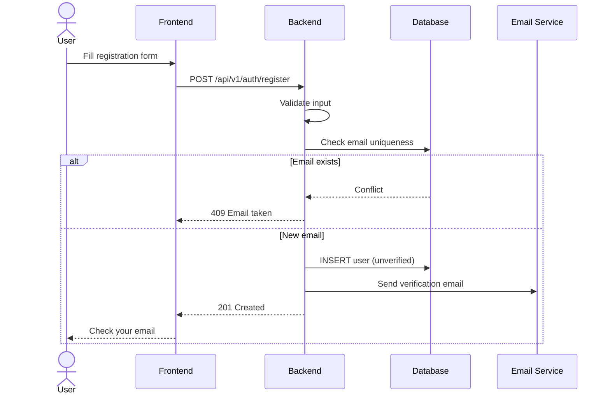
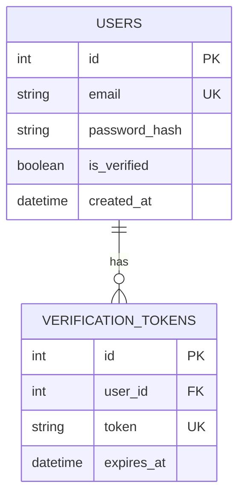

# Create Pull Request

Create a well-structured GitHub pull request with Mermaid diagrams, issue linking, and conventional commit title format.

## Input
$ARGUMENTS — Optional: target branch (defaults to main), or issue number to link.

## Process

1. **Load git-workflow skill** from `.claude/skills/foundation/git-workflow/SKILL.md`
2. **Analyze branch state**:
   - `git log main..HEAD --oneline` — all commits in this branch
   - `git diff main...HEAD --stat` — all changes vs base branch
   - `git diff main...HEAD` — full diff for understanding changes
   - Check if branch tracks a remote and is up to date
3. **Determine PR title** using conventional commit format:
   - Analyze the dominant change type across all commits
   - `feat(scope): description` for features
   - `fix(scope): description` for bug fixes
   - Keep under 72 characters
4. **Generate PR body** with:

   ### Summary section
   - 1-3 bullet points describing the changes

   ### Related Issues section
   - Parse commit messages for `#N` references
   - If $ARGUMENTS contains an issue number, add `Closes #N`
   - If no issue exists, offer to create one first

   ### Architecture/Data Flow diagrams (Mermaid)
   Based on the nature of changes, include relevant diagrams:
   - **API changes** → Sequence diagram showing request flow
   - **Database changes** → ER diagram showing schema
   - **State changes** → State diagram showing transitions
   - **Architecture changes** → C4-style container diagram
   - **Logic changes** → Flowchart showing decision logic
   - Include "Before vs After" diagrams for refactoring PRs

   ### Changes section
   - Categorized list of what changed (added, modified, removed)

   ### Test Plan section
   - Checklist of testing performed

5. **Push branch** if not already pushed (`git push -u origin <branch>`)
6. **Create PR** using `gh pr create` with heredoc body
7. **Return PR URL**

## Output
- PR created with rich body including Mermaid diagrams
- PR URL for user to review

## Example Output

```
gh pr create --title "feat(api): add user registration with email verification" --body "$(cat <<'EOF'
## Summary
- Add POST /api/v1/auth/register endpoint with email/password validation
- Implement email verification flow with token expiry
- Add rate limiting on registration endpoint (5 req/min)

Closes #42

## Architecture

### Registration Flow


### Database Changes


## Changes
- **Added**: `app/api/v1/auth.py` — registration endpoint
- **Added**: `app/models/user.py` — User and VerificationToken models
- **Added**: `app/services/email.py` — email verification service
- **Modified**: `app/main.py` — mount auth router
- **Added**: `tests/api/test_auth.py` — registration tests

## Test Plan
- [x] Unit tests for registration validation
- [x] Integration test for full registration flow
- [x] Rate limiting verified with 6 rapid requests
- [x] Email uniqueness constraint verified

EOF
)"
```
