# Git Workflow

## Commit Style Options

This project supports two commit styles. Choose one and stay consistent within a project.

### Option A: Conventional Commits (default)

```
<type>(<scope>): <subject>

<body>

<footer>
```

### Option B: Gitmoji Style (tiangolo/FastAPI-inspired)

```
<emoji> <imperative-description>
```

Single-line, no body. The emoji IS the type indicator. PR number appended on merge: `(#N)`.

**Examples:**
- `✨ Add support for user registration endpoint`
- `🐛 Fix token expiry race condition in auth middleware`
- `📝 Update OpenAPI spec with new endpoints`
- `♻️ Refactor models to extract base class`
- `⬆️ Bump FastAPI from 0.114 to 0.115`
- `🔖 Release version 1.2.0`

---

## Gitmoji Reference (tiangolo style)

| Emoji | Type | SemVer | Usage |
|-------|------|--------|-------|
| `✨` | Feature | MINOR | New feature or capability |
| `🐛` | Bug fix | PATCH | Fix a bug |
| `📝` | Docs | - | Documentation changes |
| `✏️` | Typo | - | Fix typos or minor text |
| `♻️` | Refactor | - | Code restructuring, no behavior change |
| `⬆️` | Upgrade | PATCH | Dependency upgrade |
| `🔧` | Config | - | Configuration file changes |
| `🔨` | Tooling | - | Scripts, dev tools |
| `👷` | CI | - | CI/CD pipeline changes |
| `🔖` | Release | - | Release/version tag |
| `🗑️` | Deprecate | - | Deprecate feature |
| `🔒️` | Security | PATCH | Security fix |
| `🎨` | Style | - | Code formatting, style |
| `✅` | Tests | - | Add or update tests |
| `🔥` | Remove | - | Remove code or files |
| `➖` | Remove dep | - | Remove a dependency |
| `🌐` | i18n | - | Internationalization/translation |
| `👥` | People | - | Update contributors |
| `⚡` | Perf | PATCH | Performance improvement |
| `🏗️` | Arch | - | Architectural changes |

### PR Labels (tiangolo convention)

Every PR must have exactly one of these labels (maps to release notes sections):

| Label | Release Section | When |
|-------|----------------|------|
| `breaking` | Breaking Changes | Breaking API changes |
| `security` | Security | Security fixes |
| `feature` | Features | New features |
| `bug` | Fixes | Bug fixes |
| `refactor` | Refactors | Code restructuring |
| `upgrade` | Upgrades | Dependency updates |
| `docs` | Docs | Documentation |
| `internal` | Internal | CI, tooling, scripts |

---

## Conventional Commits Reference

### Format
```
<type>(<scope>): <subject>

<body>

<footer>
```

### Types (Semantic Versioning Impact)

| Type | SemVer | Gitmoji | Description | Example |
|------|--------|---------|-------------|---------|
| `feat` | MINOR | ✨ | New feature | `feat(api): add user registration endpoint` |
| `fix` | PATCH | 🐛 | Bug fix | `fix(auth): resolve token expiry race condition` |
| `docs` | - | 📝 | Documentation only | `docs(api): update OpenAPI spec with new endpoints` |
| `style` | - | 🎨 | Code style (no logic change) | `style(backend): apply ruff formatting` |
| `refactor` | - | ♻️ | Code restructuring | `refactor(models): extract base model class` |
| `perf` | PATCH | ⚡ | Performance improvement | `perf(queries): add index for user lookup` |
| `test` | - | ✅ | Add/update tests | `test(api): add integration tests for auth flow` |
| `build` | - | 🔨 | Build system changes | `build(docker): optimize multi-stage Dockerfile` |
| `ci` | - | 👷 | CI/CD changes | `ci(github): add deploy workflow for staging` |
| `chore` | - | 🔧 | Maintenance tasks | `chore(deps): update FastAPI to 0.115.x` |
| `revert` | varies | ⏪ | Revert a previous commit | `revert: feat(api): add user registration` |

### Breaking Changes
Append `!` after type/scope or add `BREAKING CHANGE:` footer:
```
feat(api)!: change authentication to OAuth2

BREAKING CHANGE: JWT tokens are no longer accepted. Use OAuth2 bearer tokens.
Closes #42
```

### Scopes
| Scope | When |
|-------|------|
| `backend` | Backend code changes |
| `frontend` | Frontend code changes |
| `database` | Schema, migrations, queries |
| `api` | API contract changes |
| `auth` | Authentication/authorization |
| `devops` | Docker, CI/CD, infrastructure |
| `docs` | Documentation |
| `deps` | Dependency updates |
| `stage-N` | SDLC pipeline stage N |
| `infra` | Infrastructure-as-Code |

### Subject Rules
- Use imperative mood: "add" not "added" or "adds"
- No period at the end
- Max 72 characters
- Lowercase first letter

### Body Rules
- Explain WHY, not WHAT (the diff shows WHAT)
- Wrap at 72 characters
- Separate from subject with blank line
- Use bullet points for multiple items

### Footer Rules
- `Closes #N` or `Fixes #N` — link to GitHub issues
- `BREAKING CHANGE: description` — for breaking changes
- `Refs #N` — reference related issues without closing

## Semantic Git Tags

### Version Format
```
v<major>.<minor>.<patch>[-<prerelease>]
```

### Tagging Rules

| Commit Type | Version Bump | Example |
|-------------|-------------|---------|
| `feat` | MINOR | v1.0.0 → v1.1.0 |
| `feat!` / `BREAKING CHANGE` | MAJOR | v1.1.0 → v2.0.0 |
| `fix` / `perf` | PATCH | v1.1.0 → v1.1.1 |
| `docs` / `style` / `refactor` / `test` / `ci` / `chore` | No bump | - |

### Tag Commands
```bash
# Create annotated tag
git tag -a v1.0.0 -m "Release v1.0.0: initial release with core CRUD"

# Create tag for specific commit
git tag -a v1.1.0 -m "Release v1.1.0: add authentication" abc1234

# Push tags
git push origin --tags

# List tags
git tag -l "v*" --sort=-v:refname
```

### SDLC Stage Tags
Tag after each major stage completion:
```bash
git tag -a stage-1-complete -m "Requirements analysis complete"
git tag -a stage-2-complete -m "Architecture design complete"
git tag -a stage-3-complete -m "Implementation complete"
git tag -a stage-4-complete -m "Testing and validation complete"
git tag -a v1.0.0 -m "Release v1.0.0: MVP complete"
```

## GitHub Issue Creation

### Issue Templates

#### Feature Issue
```bash
gh issue create \
  --title "feat: <short description>" \
  --body "$(cat <<'ISSUE_EOF'
## Summary
<1-2 sentences describing the feature>

## Motivation
<Why is this needed? What problem does it solve?>

## Acceptance Criteria
- [ ] <criterion 1>
- [ ] <criterion 2>
- [ ] <criterion 3>

## Technical Notes
<Any implementation hints, constraints, or dependencies>

## Design
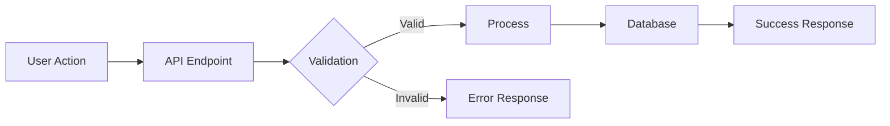

## Labels
- `enhancement`
- `<scope>`
ISSUE_EOF
)" \
  --label "enhancement"
```

#### Bug Issue
```bash
gh issue create \
  --title "fix: <short description>" \
  --body "$(cat <<'ISSUE_EOF'
## Bug Description
<What is happening vs what should happen>

## Steps to Reproduce
1. <step 1>
2. <step 2>
3. <step 3>

## Expected Behavior
<What should happen>

## Actual Behavior
<What actually happens>

## Environment
- OS: <os>
- Version: <version>
- Stack: <Python/Node>

## Error Output
```
<paste error here>
```

## Labels
- `bug`
- `<severity>`
ISSUE_EOF
)" \
  --label "bug"
```

#### Architecture/Design Issue
```bash
gh issue create \
  --title "docs: <design decision description>" \
  --body "$(cat <<'ISSUE_EOF'
## Design Decision
<What architectural decision needs to be made>

## Context
<Background and constraints>

## Options Considered

### Option A: <name>
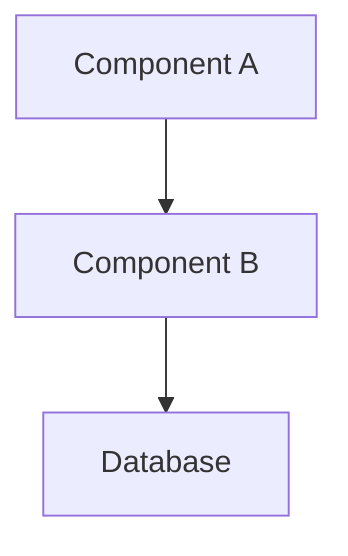
**Pros:** <list>
**Cons:** <list>

### Option B: <name>
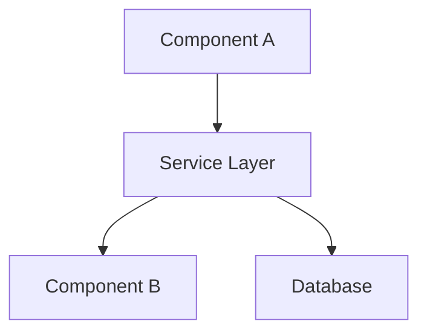
**Pros:** <list>
**Cons:** <list>

## Recommendation
<Which option and why>

## Labels
- `architecture`
- `decision`
ISSUE_EOF
)" \
  --label "architecture"
```

## Pull Request Format

### PR Title
Follow conventional commit format:
```
<type>(<scope>): <short description>
```

### PR Body Template
```markdown
## Summary
<1-3 bullet points describing what this PR does>

## Related Issues
Closes #<issue_number>
Refs #<related_issue>

## Changes

### What Changed
- <change 1>
- <change 2>
- <change 3>

### Architecture Impact
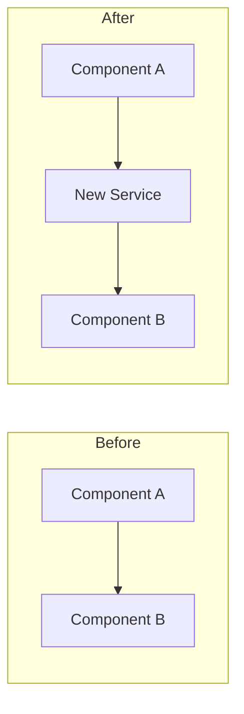

### Data Flow
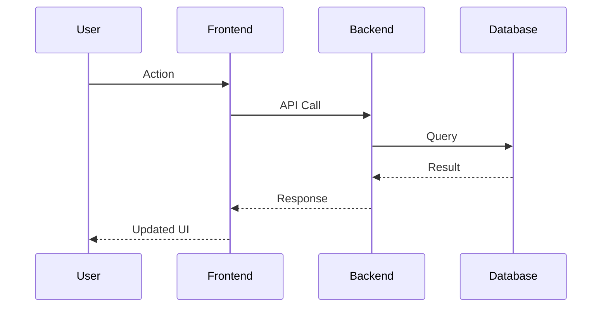

### Database Changes
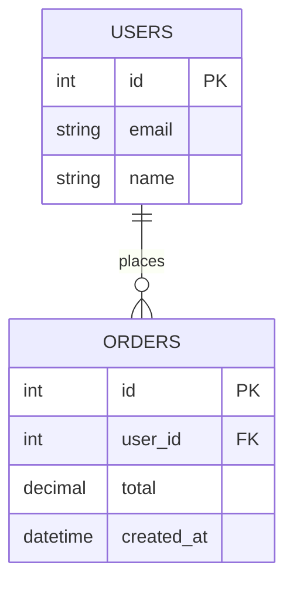

## Test Plan
- [ ] Unit tests pass
- [ ] Integration tests pass
- [ ] E2E happy path verified
- [ ] Manual testing completed

## Screenshots / Demo
<if applicable>

## Checklist
- [ ] Code follows project conventions
- [ ] Tests added/updated
- [ ] Documentation updated
- [ ] No secrets committed
- [ ] Breaking changes documented
```

## Mermaid Diagram Types for PRs

### 1. Flowchart (Decision Logic)
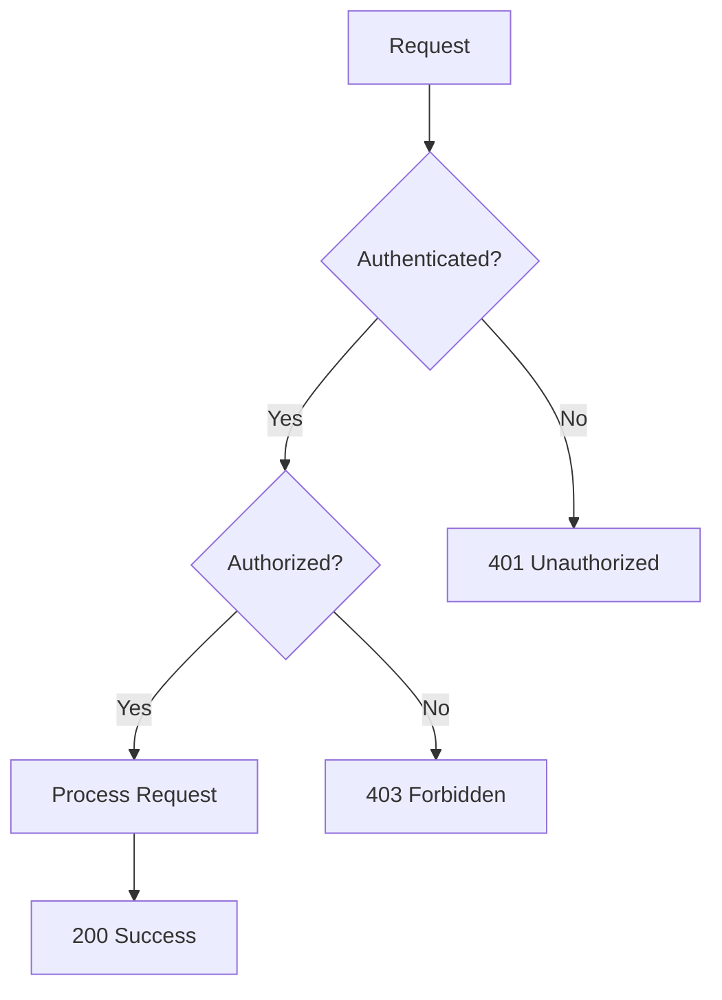

### 2. Sequence Diagram (API Flow)
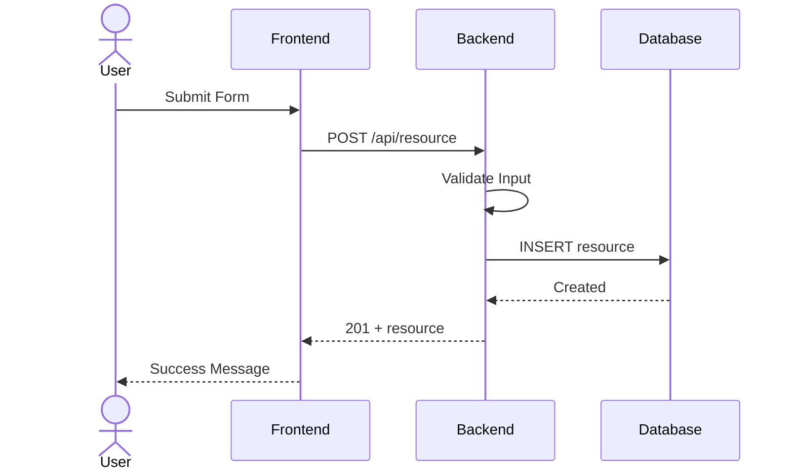

### 3. Entity Relationship (Database Changes)
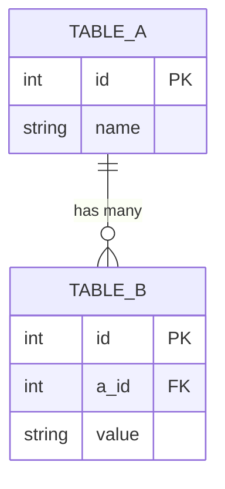

### 4. State Diagram (Status Transitions)
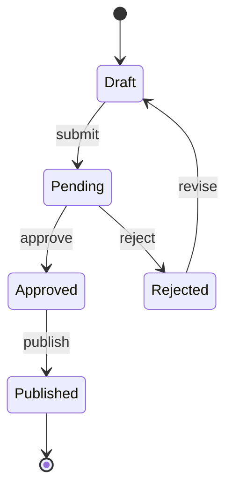

### 5. C4 Container (Architecture Changes)
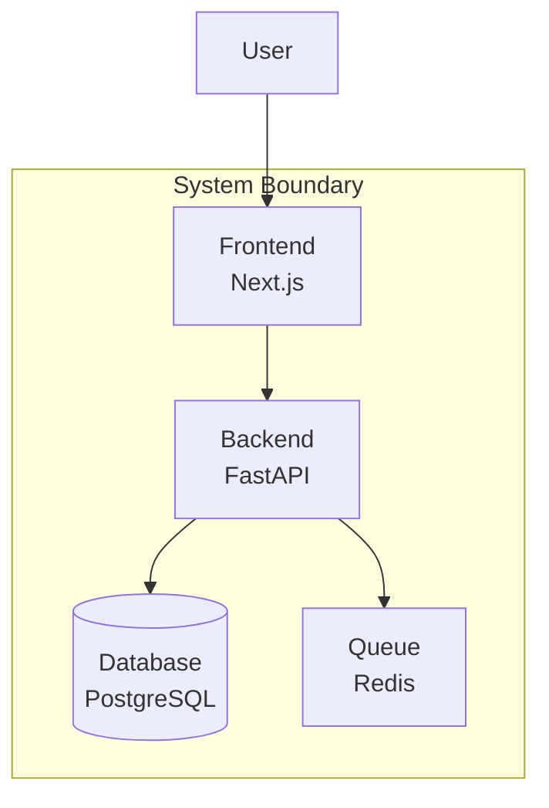

## Changeset Tracking Workflow

### Full Workflow: Issue → Branch → Commits → PR → Merge

```bash
# 1. Create GitHub issue
ISSUE_URL=$(gh issue create \
  --title "feat(api): add user registration endpoint" \
  --body "..." \
  --label "enhancement" \
  | tail -1)
ISSUE_NUM=$(echo "$ISSUE_URL" | grep -oE '[0-9]+$')

# 2. Create feature branch from issue
git checkout -b feat/issue-${ISSUE_NUM}-user-registration

# 3. Make commits referencing the issue
git commit -m "feat(api): add user registration endpoint

Implement POST /api/v1/auth/register with email/password validation.
Passwords hashed with bcrypt, JWT issued on success.

Refs #${ISSUE_NUM}"

# 4. Push and create PR linking the issue
git push -u origin feat/issue-${ISSUE_NUM}-user-registration

gh pr create \
  --title "feat(api): add user registration endpoint" \
  --body "$(cat <<PR_EOF
## Summary
- Add POST /api/v1/auth/register endpoint
- Email validation and bcrypt password hashing
- JWT token issued on successful registration

Closes #${ISSUE_NUM}

## Changes
...

## Test Plan
- [ ] Unit tests for registration logic
- [ ] Integration test for full registration flow
- [ ] Manual test with Postman collection
PR_EOF
)"

# 5. After merge, tag if needed
git checkout main && git pull
git tag -a v1.1.0 -m "Release v1.1.0: add user registration

Closes #${ISSUE_NUM}"
git push origin v1.1.0
```

### Linking Conventions
| Keyword | Effect |
|---------|--------|
| `Closes #N` | Closes issue when PR merges |
| `Fixes #N` | Closes issue when PR merges |
| `Resolves #N` | Closes issue when PR merges |
| `Refs #N` | References without closing |
| `Part of #N` | Partial work toward issue |

## Release Notes Automation (tiangolo-style)

### GitHub Action: Auto-generate Release Notes

Add to `solution/.github/workflows/latest-changes.yml`:

```yaml
name: Latest Changes

on:
  pull_request_target:
    branches: [main]
    types: [closed]

jobs:
  latest-changes:
    if: github.event.pull_request.merged == true
    runs-on: ubuntu-latest
    permissions:
      contents: write

    steps:
      - uses: actions/checkout@v4
        with:
          token: ${{ secrets.GITHUB_TOKEN }}

      - uses: tiangolo/latest-changes@0.4.1
        with:
          token: ${{ secrets.GITHUB_TOKEN }}
          latest_changes_file: CHANGELOG.md
          latest_changes_header: '## Latest Changes'
          end_regex: '^## '
          label_header_prefix: '### '
          debug_logs: true
```

### Label → Release Notes Section Mapping

Configure labels in the repo settings or via `.github/labels.yml`:

```yaml
# .github/labels.yml (for use with github-labeler action)
- name: breaking
  color: "d73a4a"
  description: "Breaking changes"
- name: security
  color: "e4e669"
  description: "Security fixes"
- name: feature
  color: "0075ca"
  description: "New features"
- name: bug
  color: "d73a4a"
  description: "Bug fixes"
- name: refactor
  color: "cfd3d7"
  description: "Code refactoring"
- name: upgrade
  color: "0e8a16"
  description: "Dependency upgrades"
- name: docs
  color: "0075ca"
  description: "Documentation changes"
- name: internal
  color: "ededed"
  description: "Internal/CI/tooling changes"
```

### Auto-generated Release Notes Format

After PRs merge, `CHANGELOG.md` is automatically updated:

```markdown
## Latest Changes

### Features

* ✨ Add user registration with email verification. PR [#42](https://github.com/org/repo/pull/42) by [@author](https://github.com/author).

### Fixes

* 🐛 Fix token expiry race condition in auth. PR [#43](https://github.com/org/repo/pull/43) by [@author](https://github.com/author).

### Internal

* 👷 Add deploy workflow for staging. PR [#44](https://github.com/org/repo/pull/44) by [@author](https://github.com/author).
```

### Auto-labeler for PRs

Add `.github/labeler.yml` to auto-label based on file paths:

```yaml
# .github/labeler.yml
feature:
  - changed-files:
    - any-glob-to-any-file:
      - 'backend/app/**'
      - 'frontend/app/**'
      - 'frontend/components/**'

bug:
  - changed-files:
    - any-glob-to-any-file:
      - '**/*fix*'

docs:
  - changed-files:
    - any-glob-to-any-file:
      - 'docs/**'
      - '**/*.md'
      - 'solution/docs/**'

internal:
  - changed-files:
    - any-glob-to-any-file:
      - '.github/**'
      - 'scripts/**'
      - '.claude/**'

upgrade:
  - changed-files:
    - any-glob-to-any-file:
      - '**/pyproject.toml'
      - '**/package.json'
      - '**/package-lock.json'
      - '**/uv.lock'
```

And the labeler workflow:

```yaml
# .github/workflows/labeler.yml
name: Labeler

on:
  pull_request_target:
    types: [opened, synchronize]

permissions:
  contents: read
  pull-requests: write

jobs:
  label:
    runs-on: ubuntu-latest
    steps:
      - uses: actions/labeler@v5
        with:
          repo-token: ${{ secrets.GITHUB_TOKEN }}
```

## Release Workflow

### Creating a Release

```bash
# 1. Determine version bump from merged PRs since last tag
LAST_TAG=$(git describe --tags --abbrev=0 2>/dev/null || echo "v0.0.0")
echo "Last release: $LAST_TAG"

# 2. Check commits since last tag for bump type
# - Any feat → MINOR
# - Any fix/perf → PATCH
# - Any BREAKING CHANGE or feat! → MAJOR
git log ${LAST_TAG}..HEAD --oneline

# 3. Create release commit and tag
# Conventional style:
git commit --allow-empty -m "chore(release): release v1.2.0"
git tag -a v1.2.0 -m "Release v1.2.0"

# Gitmoji style (tiangolo):
git commit --allow-empty -m "🔖 Release version 1.2.0"
git tag -a 1.2.0 -m "Release 1.2.0"  # Note: no 'v' prefix

# 4. Push
git push origin main --tags

# 5. Create GitHub release (auto-generates notes from PRs)
gh release create v1.2.0 --generate-notes --title "v1.2.0"

# Or with custom notes:
gh release create v1.2.0 --title "v1.2.0" --notes "$(cat <<'NOTES'
## Highlights
- ✨ User registration with email verification
- 🐛 Fixed auth token race condition
- ⚡ 3x faster query performance on user lookups

## Full Changelog
See CHANGELOG.md for details.
NOTES
)"
```
