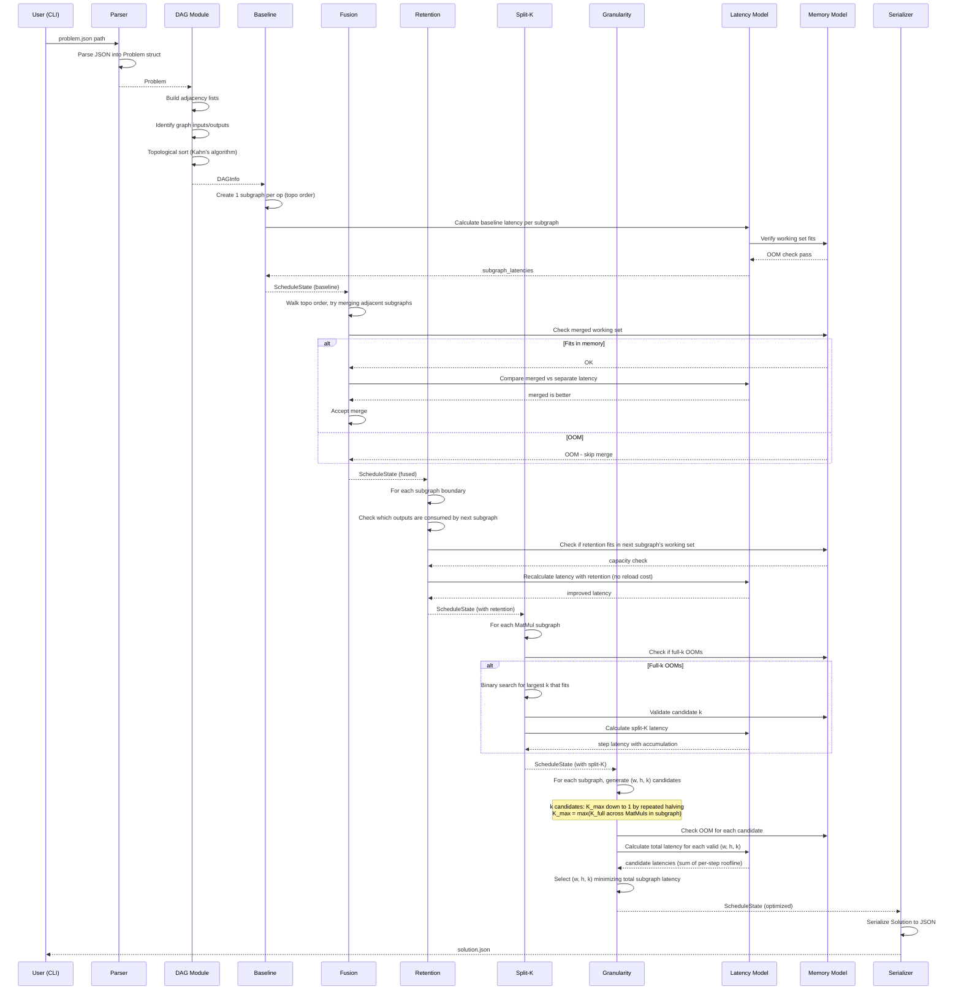
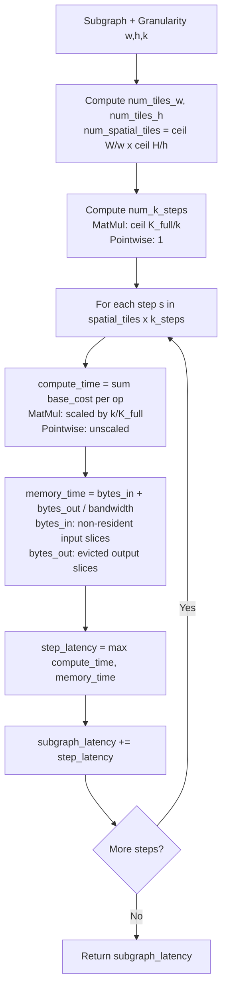
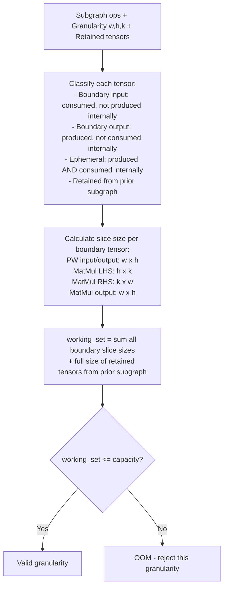

# Data Flow Diagrams

## Scheduler Pipeline (End-to-End)

## Per-Subgraph Latency Calculation (Detailed)

## Working-Set Check Flow

## Optimizer Stage Composition

```mermaid
flowchart LR
    S1[1. Baseline<br>1 op/subgraph<br>native granularity]
    S2[2. Greedy Fusion<br>Merge adjacent ops]
    S3[3. Retention pass 1<br>Keep tensors resident]
    S4[4. Split-K<br>Reduce k for OOM relief]
    S5[5. Granularity Search<br>Optimize w,h,k per subgraph<br>k: K_max...1 by halving]
    S6[6. Retention pass 2<br>Re-evaluate after granularity changes]
    S7[7. Emergency OOM Fix<br>Reduce granularity for any remaining OOM]
    S8[8. Final Latency<br>Recalculate all subgraph latencies]
    S9[9. Traversal Optimization<br>Snake order for MatMul data reuse]

    S1 --> S2 --> S3 --> S4 --> S5 --> S6 --> S7 --> S8 --> S9
```

Each optimizer stage mutates `Vec<SubgraphDef>` in place. They execute in a fixed sequence of 9 stages.

Each stage only improves or maintains the schedule -- never degrades it. If a stage finds no improvement, it passes the schedule through unchanged.
