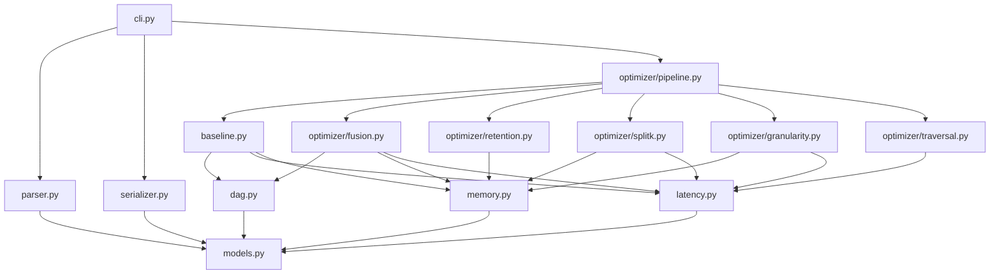

# System Design: MLSys DAG Scheduler

## System Type

This is a **computational optimization tool**, not a web service. It is a single-process Python CLI that reads a problem JSON, computes an optimized execution schedule, and writes a solution JSON.

## Scale Estimates

- Input size: 2 ops / 3 tensors (trivial) to 96 ops / 160 tensors (benchmark 17)
- Runtime target: < 5 minutes per benchmark on a standard developer machine
- No concurrency, no network, no database
- Memory: All data fits easily in RAM (< 1 MB input, < 10 MB working state)

---

## Module Decomposition

```
mlsys_scheduler/
    __init__.py
    cli.py                  # Entry point: argparse, file I/O
    models.py               # Data classes (Problem, Tensor, Op, Granularity, Subgraph, Solution)
    parser.py               # JSON -> Problem
    serializer.py           # Solution -> JSON
    dag.py                  # DAG utilities: topological sort, adjacency, reachability
    latency.py              # Latency model: compute_time, memory_time, subgraph_latency
    memory.py               # Working-set calculator, OOM checker
    baseline.py             # Naive scheduler: one op per subgraph, native granularity
    optimizer/
        __init__.py
        fusion.py           # Greedy bottom-up chain fusion
        retention.py        # Tensor retention decision logic
        splitk.py           # Split-K search for MatMul subgraphs
        granularity.py      # Granularity search (w, h, k candidates)
        traversal.py        # Traversal order optimization (snake/zig-zag)
        pipeline.py         # Orchestrates optimizer stages in sequence
```

### Module Dependency Graph



---

## Data Model

All data structures are Python `dataclasses` with type annotations. They mirror the C++ structs in `mlsys.h`.

### Core Types

```python
@dataclass
class Tensor:
    width: int       # number of columns
    height: int      # number of rows
    # size = width * height (elements, not bytes)

@dataclass
class Op:
    op_type: str     # "MatMul" or "Pointwise"
    inputs: list[int]   # tensor indices consumed (for MatMul: [LHS, RHS])
    outputs: list[int]  # tensor indices produced
    base_cost: int      # compute cost at native granularity per tile

@dataclass
class Granularity:
    w: int    # spatial width of output slice
    h: int    # spatial height of output slice
    k: int    # reduction depth (only meaningful for MatMul)

@dataclass
class Problem:
    tensors: list[Tensor]
    ops: list[Op]
    fast_memory_capacity: int
    slow_memory_bandwidth: int
    native_granularity: tuple[int, int]  # (native_w, native_h)

@dataclass
class SubgraphDef:
    ops: list[int]              # op indices in this subgraph
    granularity: Granularity
    tensors_to_retain: list[int]   # tensor indices to keep in fast memory after
    traversal_order: list[int] | None  # permutation of tile indices, or None for raster
    subgraph_latency: float

@dataclass
class Solution:
    subgraphs: list[SubgraphDef]
```

---

## Algorithm Pipeline

The scheduler executes the following stages in strict sequence:

```
Input JSON
    |
    v
[1. Parse] -----> Problem struct
    |
    v
[2. DAG Analysis] --> topological order, adjacency lists,
    |                  graph inputs/outputs identification
    v
[3. Baseline Schedule] --> one op per subgraph, native granularity,
    |                       no retention, no fusion
    v
[4. Greedy Fusion] --> merge adjacent ops into subgraphs
    |                   where working set fits in fast memory
    v
[5. Tensor Retention] --> for each subgraph boundary, decide which
    |                      output tensors to retain in fast memory
    v
[6. Split-K Search] --> for MatMul subgraphs where full-k OOMs,
    |                    find largest k divisor that fits
    v
[7. Granularity Search] --> for each subgraph, search candidate
    |                        (w, h) values to minimize latency
    v
[8. Latency Calculation] --> compute final subgraph_latencies
    |
    v
[9. Serialize] --> Solution JSON
```

Each stage takes the current schedule and refines it. Stages 4-7 are the optimization core. The baseline (stage 3) guarantees a valid output even if all optimizers are disabled.

---

## Latency Model Specification

The latency model implements the roofline evaluation described in PROBLEM.md and must match the C++ `Evaluate()` function exactly.

### Key Concepts

**Spatial Tiles**: For a subgraph with output tensor of dimensions `(W_out, H_out)` and granularity `(w, h, k)`:
- `num_tiles_w = ceil(W_out / w)` -- number of spatial tiles along width
- `num_tiles_h = ceil(H_out / h)` -- number of spatial tiles along height
- `num_spatial_tiles = num_tiles_w * num_tiles_h`

**K-Steps (Split-K)**: For MatMul with reduction dimension `K_full`:
- `num_k_steps = ceil(K_full / k)`
- For Pointwise: `num_k_steps = 1` (k is ignored)

**Total Iterations**: `num_spatial_tiles * num_k_steps`

However, the roofline is applied **per execution step**, and total latency is the **sum** of per-step latencies.

### Per-Step Latency Formulas

For each execution step (one spatial tile, one k-step):

#### Compute Time

```
compute_time_per_step = sum(op.base_cost for op in subgraph.ops)
```

**Hardware padding rule**: If `w < native_w` or `h < native_h`, the compute cost per step is unchanged (the hardware pads to native size, so you pay full cost but produce a smaller output tile). The cost is already accounted for by the increased number of spatial tiles. Specifically:

- The `base_cost` is the cost for **one execution at native granularity**
- When granularity equals native: `base_cost` is the cost per tile, and `num_spatial_tiles` tiles cover the full tensor
- When granularity is smaller: `base_cost` is still the cost per tile (hardware pads), but more tiles are needed

**Reduction scaling**: For MatMul, each k-step costs `base_cost * (k / K_full)` where `K_full` is the op's full reduction dimension. Verified against Example 5B: `k=32`, `K_full=128`, `base_cost=2000` per op, compute per step = `2000*(32/128) + 2000*(32/128) = 1000`.

For Pointwise, k is irrelevant — full `base_cost` per step. Verified against Example 1C: `base_cost=1000+100=1100` per step, 4 tiles.

**Spatial padding**: if `w < native_w` or `h < native_h`, you still pay full `base_cost` per step (hardware pads), but need more spatial tiles to cover the tensor.

**Summary**:
```
For each op in subgraph:
    if op.op_type == "MatMul":
        compute_cost = op.base_cost * (k / K_full_for_this_op)
    else:  # Pointwise
        compute_cost = op.base_cost

compute_time_per_step = sum(compute_cost for each op)
```

Where `K_full_for_this_op` is the inner/reduction dimension of that specific MatMul (the width of the LHS input = height of the RHS input... actually: for MatMul with inputs [LHS, RHS], `K_full = LHS.width = RHS.height`).

Actually, let me re-examine. From the granularity definition:
- LHS input slice: width `k`, height `h`
- RHS input slice: width `w`, height `k`
- Output slice: width `w`, height `h`

So the full LHS tensor has width = `K_full` and height = `H_out`. The full RHS tensor has width = `W_out` and height = `K_full`. Therefore `K_full` = LHS.width = RHS.height.

#### Memory Time (Per Step)

For each execution step, we must account for data loaded from slow memory and data evicted to slow memory.

**Inputs loaded from slow memory**:
- For each **boundary input** tensor of the subgraph (not ephemeral):
  - Compute the slice size based on the op type and granularity
  - If the tensor is already resident in fast memory (retained from previous subgraph, or already loaded in a previous step of the same subgraph via intra-subgraph reuse), it costs 0
  - Otherwise: `slice_size / slow_memory_bandwidth`

**Slice sizes** (for one spatial tile + one k-step):
- Pointwise input: `w * h` elements
- Pointwise output: `w * h` elements
- MatMul LHS input: `h * k` elements
- MatMul RHS input: `k * w` elements
- MatMul output: `w * h` elements

**Outputs evicted to slow memory**:
- Output slices that are NOT retained and are NOT ephemeral must be evicted
- Eviction happens on the **last k-step** for that spatial tile (for split-K, eviction only on final accumulation step)
- Actually, from Example 5B, eviction of Tensor4 only happens on step 4 (the last k-step). In the non-split-K case, every spatial tile evicts.

**Memory time per step**:
```
memory_time = (bytes_loaded_from_slow + bytes_evicted_to_slow) / slow_memory_bandwidth
```

**Intra-subgraph data reuse (traversal order)**: When processing spatial tiles, input strips may be reused across adjacent tiles. In raster order for MatMul:
- Moving to the next column: LHS row strip is reused, RHS column strip is reloaded
- Moving to the next row: both are reloaded (LHS row strip changes, RHS column strip was evicted)

In snake/zig-zag order: one of the two input strips is always reused between consecutive tiles.

#### Total Subgraph Latency

```
subgraph_latency = sum over all steps of:
    max(compute_time_per_step, memory_time_per_step)
```

#### Total Graph Latency

```
total_latency = sum(sg.subgraph_latency for sg in solution.subgraphs)
```

---

## Working-Set Calculation

The working set is the total fast-memory capacity consumed during one execution iteration.

### For a Subgraph with Granularity (w, h, k)

1. Identify **boundary inputs**: tensors consumed by the subgraph that are NOT produced within the subgraph (not ephemeral)
2. Identify **boundary outputs**: tensors produced by the subgraph that are NOT consumed within the subgraph, OR that are listed in `tensors_to_retain`
3. Identify **ephemeral tensors**: produced and consumed within the same subgraph -- these consume 0 capacity
4. Add **retained tensors** from previous subgraphs that are still in fast memory

For each boundary tensor, compute its slice size:

| Tensor Role | Op Type | Slice Size |
|-------------|---------|------------|
| Pointwise input | Pointwise | `w * h` |
| Pointwise output | Pointwise | `w * h` |
| MatMul LHS input | MatMul | `h * k` |
| MatMul RHS input | MatMul | `k * w` |
| MatMul output | MatMul | `w * h` |

**Special case for output-stationary (split-K)**: The output/accumulator tensor (`w * h`) is held resident across all k-steps. Input strips are streamed.

**Working set**:
```
working_set = sum(slice_size for each boundary input and output tensor that must
                  be simultaneously resident in fast memory during one step)
            + sum(size of retained tensors from previous subgraphs)
```

**OOM check**: `working_set <= fast_memory_capacity`

### Retained Tensors from Previous Subgraphs

When a previous subgraph retains a tensor, that tensor occupies fast memory at its **full size** (not a slice), because it was computed across all spatial tiles and remains fully materialized.

Wait -- actually, retained tensors are computed slice-by-slice but the full tensor accumulates. Let me reconsider.

Actually, from Example 3C: Tensor1 (128x128 = 16384) is retained. The working set of subgraph 1 must include this full tensor. The subgraph 1 has Tensor1 as input (already resident), processes Op1 and Op2 producing Tensor3. Working set = Tensor1 (16384, resident) + Tensor2 (ephemeral, 0) + Tensor3 output (16384) = 32768 <= 50000. This works.

But wait -- if the subgraph uses a granularity smaller than the tensor, only a slice of the retained tensor is needed per step. The retained tensor is at full size in fast memory though (it was fully computed by the prior subgraph at its granularity).

Actually, the problem says retained tensors stay in fast memory at full size. The working set calculation must include:
- The **full size** of all currently retained tensors
- Plus the **slice sizes** of all boundary inputs/outputs needed for the current execution step

Correction: from Example 5B, the accumulator Tensor4 (128x128 = 16384) and Tensor0 (128x128 = 16384) are resident, plus Tensor1 strip (128x32 = 4096) and Tensor2 strip (32x128 = 4096). Working set = 16384 + 16384 + 4096 + 4096 = 40960. That matches.

But Tensor0 is a full input that gets loaded in step 1 and reused. It's NOT a retained tensor from a previous subgraph -- it's loaded in this subgraph. Tensor4 is the accumulator (output). So the working set includes:
- Full-size inputs that are resident (loaded once, reused): full tensor size
- Streamed input strips: slice size
- Output/accumulator: slice size (w * h)

This is more nuanced. The working set depends on which step we're computing and the traversal order. The **maximum** working set across all steps must fit.

For the OOM check, we need the **worst-case step** (typically the first step, where the most data is loaded fresh).

---

## Memory Hierarchy Summary

| Tier | Capacity | Access Cost | Persistence |
|------|----------|-------------|-------------|
| Slow Memory | Infinite | `size / bandwidth` per transfer | Permanent (graph I/O lives here) |
| Fast Memory | `fast_memory_capacity` elements | 0 (instant access) | Explicit: evicted unless retained |
| Ephemeral | 0 (no capacity consumed) | 0 | Intra-subgraph only |

---

## Key Formulas Reference

### Tensor Slice Sizes

For granularity `(w, h, k)`:

| Role | Width | Height | Size |
|------|-------|--------|------|
| Output (any op) | w | h | w * h |
| Pointwise input | w | h | w * h |
| MatMul LHS input | k | h | h * k |
| MatMul RHS input | w | k | k * w |

### Number of Tiles

```
num_tiles_w = ceil(output_tensor.width / w)
num_tiles_h = ceil(output_tensor.height / h)
num_spatial_tiles = num_tiles_w * num_tiles_h
```

### Number of K-Steps

```
For MatMul: num_k_steps = ceil(K_full / k)
For Pointwise-only subgraphs: num_k_steps = 1
```

### Compute Cost Per Step

```
compute_per_step = sum for each op in subgraph:
    if MatMul: base_cost * min(k, K_full_remaining) / native_k
    if Pointwise: base_cost
```

Actually, let me be more precise. From the problem: "choosing k below native simply runs fewer cycles, dividing compute proportionally without waste." So for MatMul:
```
compute_per_matmul_step = base_cost * (k / K_full)
```
where `K_full` is the full reduction dimension of that MatMul.

For the spatial dimensions, if `w < native_w` or `h < native_h`, you still pay `base_cost` (padded), but you need more tiles. The examples confirm this.

### Roofline Per Step

```
step_latency = max(compute_time, memory_time)
where:
    compute_time = sum of per-op compute costs for this step
    memory_time = (bytes_in + bytes_out) / slow_memory_bandwidth
```

### Total Latency

```
subgraph_latency = sum(step_latency for each step)
total_latency = sum(subgraph_latency for each subgraph)
```

---

## Benchmark Summary

| Benchmark | Ops | Tensors | Tensor Sizes | Fast Memory | Bandwidth | Pattern |
|-----------|-----|---------|-------------|-------------|-----------|---------|
| 1 | 5 | 9 | 512x512 | 60,000 | 20 | Linear chain (MatMul + Pointwise) |
| 5 | 19 | 29 | 128-1024 mixed | 30,000 | 15 | 3x attention heads + aggregation |
| 9 | 32 | 49 | 1024-4096 mixed | 250,000 | 25 | 8x repeating MatMul+PW blocks |
| 13 | 63 | 96 | 128-4096 mixed | 600,000 | 50 | 16x parallel MatMul heads + PW aggregation |
| 17 | 96 | 160 | 128-2048 mixed | 500,000 | 100 | 8x attention + 8x MLP blocks + residual |

---

## Performance Considerations

1. **No NumPy needed**: The scheduler performs only integer arithmetic, comparisons, and list operations. Pure Python is sufficient.
2. **Granularity search space**: Limit candidates to powers of 2 that divide tensor dimensions. For a 4096-wide tensor: {128, 256, 512, 1024, 2048, 4096} -- at most 6 candidates per dimension.
3. **Fusion feasibility check**: Before merging two subgraphs, check working-set OOM at the most restrictive granularity. This is O(1) per candidate merge.
4. **Topological sort**: Kahn's algorithm, O(V + E), runs once.
5. **Total optimizer complexity**: O(N^2) for fusion (N = number of ops), O(G) for granularity search per subgraph (G = candidate granularities). Well within the 5-minute budget even for benchmark 17.
