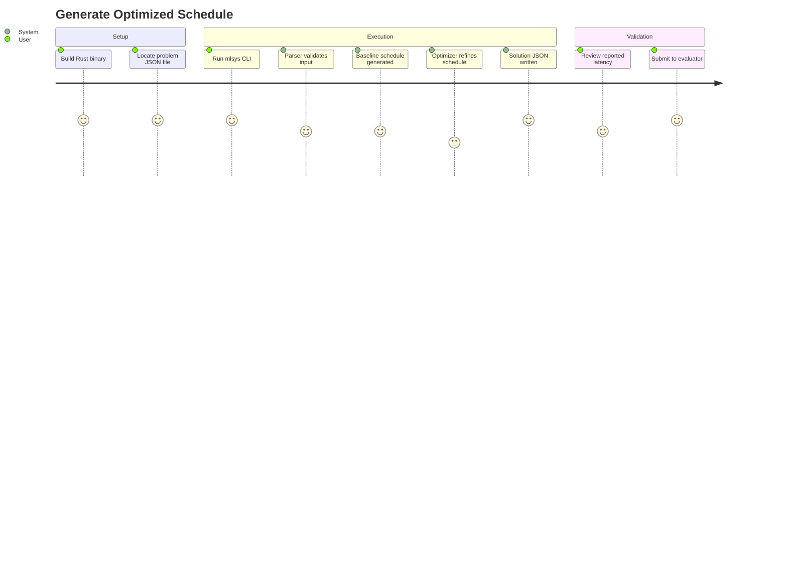

# User Journeys

## Journey 1: Generate Optimized Schedule (Track A)

### Actor: Contest Participant / Researcher
### Goal: Produce a valid, latency-minimized schedule JSON for a given problem



### Steps

| Step | Action | System Response | Module | Acceptance Criteria |
|------|--------|----------------|--------|---------------------|
| 1 | Build the binary: `cd solution/backend/rust && cargo build --release` | Compiles to `target/release/mlsys` | `Cargo.toml` | Binary produced without errors |
| 2 | User runs `./mlsys <input.json> <output.json>` | CLI parses arguments via `std::env::args()` | `main.rs` | Validates file exists and is readable |
| 3 | System parses problem JSON | Constructs `Problem` with tensors, ops, hardware params | `parser.rs` | All fields populated, tensor/op counts match JSON arrays |
| 4 | System builds DAG and topological sort | Produces `DagInfo` with adjacency, topo order, graph I/O | `dag.rs` | DAG is valid (no cycles), all ops reachable |
| 5 | System generates baseline schedule | One subgraph per op, native granularity, no retention | `baseline.rs` | Valid schedule, no OOM, all ops covered |
| 6 | System runs 9-stage optimizer pipeline | Fusion, retention, split-K, granularity search, traversal | `optimizer/pipeline.rs` | Latency <= baseline latency |
| 7 | System calculates final latencies | `subgraph_latency` populated for each subgraph | `latency.rs` | Matches roofline model to float precision |
| 8 | System writes solution JSON | Well-formed JSON on disk | `serializer.rs` | JSON round-trips through the C++ evaluator |
| 9 | System prints summary to stderr | Total latency and subgraph count | `main.rs` | Human-readable summary |

### Error Scenarios

- **File not found**: `eprintln!` with path and `std::io::Error`; exits with code 1
- **Malformed JSON**: `serde_json::Error` message printed to stderr; exits with code 1
- **Cyclic graph**: `DagInfo::build` returns `Err("DAG has a cycle")`; exits with code 1
- **All granularities OOM for a subgraph**: Emergency OOM fix stage reduces to smallest feasible granularity

---

## Journey 2: Validate Solution Against Evaluator

### Actor: Contest Participant
### Goal: Verify that a solution JSON is valid and check its latency

### Steps

| Step | Action | System Response | Module | Acceptance Criteria |
|------|--------|----------------|--------|---------------------|
| 1 | User runs `./mlsys evaluate --problem problem.json --solution solution.json` | CLI loads both files | `main.rs` | Both files parsed successfully |
| 2 | System re-evaluates solution latency | Computes per-subgraph and total latency | `evaluate.rs` | Latency matches `subgraph_latencies` in solution JSON |
| 3 | System checks constraints | OOM check, all-ops-covered check, valid traversal orders | `memory.rs`, `dag.rs` | Zero violations |
| 4 | System prints report | Total latency, per-subgraph breakdown, PASS or FAIL | `main.rs` | Clear pass/fail with detail on any failures |

### Error Scenarios

- **OOM violation**: Prints `FAIL: <error message>` and exits with code 1
- **Missing ops**: Reports which op indices are not covered
- **Latency mismatch**: Reports expected vs actual for each mismatched subgraph

---

## Journey 3: Run All Benchmarks

### Actor: Contest Participant
### Goal: Produce solutions for all 5 benchmark files

### Steps

| Step | Action | System Response | Acceptance Criteria |
|------|--------|----------------|---------------------|
| 1 | Build binary once | `cargo build --release` in `solution/backend/rust/` | Binary at `target/release/mlsys` |
| 2 | Run bash loop over benchmarks | Calls the binary for each benchmark JSON | Solution JSON written for each |
| 3 | Optionally validate each solution | Calls evaluate subcommand per benchmark | All 5 pass validation |

### Example Bash Loop

```bash
cd solution/backend/rust
cargo build --release

BINARY=./target/release/mlsys
BENCH_DIR=../../../problem/benchmarks
OUT_DIR=../../../solution/outputs

mkdir -p "$OUT_DIR"

for f in "$BENCH_DIR"/mlsys-2026-*.json; do
    name=$(basename "$f" .json)
    echo "Solving $name..."
    "$BINARY" "$f" "$OUT_DIR/${name}-solution.json"
done

echo "Done. Validating..."
for f in "$BENCH_DIR"/mlsys-2026-*.json; do
    name=$(basename "$f" .json)
    "$BINARY" evaluate --problem "$f" --solution "$OUT_DIR/${name}-solution.json"
done
```

### Edge Cases

- **Benchmark directory missing**: Shell will produce no iterations; add a guard check before the loop
- **One benchmark fails while others succeed**: The loop continues; validate separately to identify failures
- **OOM on large benchmark**: Emergency OOM fix stage handles this automatically inside the pipeline
